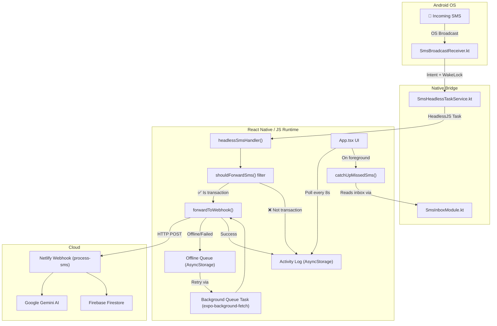

# SpendWiser Listener — Complete Architecture Walkthrough

## Project Identity

**SpendWiser Listener** is an Android companion app for the [SpendWiser](https://spenditwiser.netlify.app/) personal finance PWA. It silently intercepts bank SMS alerts on the user's Android phone and forwards them to the SpendWiser cloud backend for automated transaction tracking. Distributed via sideloading (APK) due to Google Play SMS permission restrictions.

**Version:** 1.2.1 | **Package:** `com.hariharen.spendwiser.sms`

---

## Technology Stack

| Layer | Technology |
|-------|-----------|
| **Framework** | React Native 0.81.5 + Expo SDK 54 |
| **Language** | TypeScript (UI/logic) + Kotlin (native Android modules) |
| **UI Kit** | React Native StyleSheet + `lucide-react-native` icons |
| **State** | React `useState`/`useRef` (no external state library) |
| **Persistence** | `@react-native-async-storage/async-storage` |
| **Background** | Android `BroadcastReceiver` → HeadlessJS + `expo-background-fetch` |
| **Notifications** | `expo-notifications` |
| **Build** | EAS Build (APK) + GitHub Actions CI/CD |

---

## Architecture Overview



---

## File-by-File Breakdown

### Entry Layer

#### [index.ts](file:///d:/Programming/spendwiser-listener-app/index.ts)
- Registers the root React component via `registerRootComponent(App)`
- Registers the **HeadlessJS task** `SpendWiserSmsTask` — this is the bridge name the Kotlin native code uses to invoke the JS SMS handler even when the app is killed

---

### Native Android Layer (Kotlin)

All Kotlin files live under `android/app/src/main/java/com/hariharen/spendwiser/sms/`.

#### [SmsBroadcastReceiver.kt](file:///d:/Programming/spendwiser-listener-app/android/app/src/main/java/com/hariharen/spendwiser/sms/SmsBroadcastReceiver.kt)
- Registered permanently in [AndroidManifest.xml](file:///d:/Programming/spendwiser-listener-app/android/app/src/main/AndroidManifest.xml) with `priority=999`
- Triggered by Android OS the instant an SMS arrives — even if the app is killed
- **Concatenates multi-part PDU segments** (bank SMS often exceeds 160 chars) — this was a bug fix from a previous conversation
- Extracts `originatingAddress` and `messageBody`, then starts the HeadlessJS service

#### [SmsHeadlessTaskService.kt](file:///d:/Programming/spendwiser-listener-app/android/app/src/main/java/com/hariharen/spendwiser/sms/SmsHeadlessTaskService.kt)
- Extends `HeadlessJsTaskService` — boots up the JS runtime in the background
- Passes SMS data (`originatingAddress`, `messageBody`) to the JS task `SpendWiserSmsTask`
- 10-second timeout, `allowedInForeground = true`

#### [SmsInboxModule.kt](file:///d:/Programming/spendwiser-listener-app/android/app/src/main/java/com/hariharen/spendwiser/sms/SmsInboxModule.kt)
- Custom React Native **native module** exposed as `SmsInboxReader`
- `getRecentMessages(sinceTimestamp)` — queries the device SMS inbox content provider (`content://sms/inbox`) for messages since a given epoch timestamp
- Used by the **catch-up mechanism** to recover missed SMS when the app resumes

#### [SmsInboxPackage.kt](file:///d:/Programming/spendwiser-listener-app/android/app/src/main/java/com/hariharen/spendwiser/sms/SmsInboxPackage.kt)
- Standard ReactPackage wrapper that registers `SmsInboxModule`

#### [MainApplication.kt](file:///d:/Programming/spendwiser-listener-app/android/app/src/main/java/com/hariharen/spendwiser/sms/MainApplication.kt)
- Manually adds `SmsInboxPackage()` to the React Native package list (cannot be autolinked)

#### [MainActivity.kt](file:///d:/Programming/spendwiser-listener-app/android/app/src/main/java/com/hariharen/spendwiser/sms/MainActivity.kt)
- Standard Expo-generated activity with back button behavior for Android S+

---

### TypeScript Source Layer (`src/`)

#### [src/types/index.ts](file:///d:/Programming/spendwiser-listener-app/src/types/index.ts)
Four interfaces:
- `PendingTransaction` — mirrors the Firestore schema (unused locally, kept for type parity)
- `QueuedSms` — offline retry queue items with `retryCount`, `lastRetryAt`, `error`
- `ActivityLogEntry` — log entries with `id`, `smsText`, `summary`, `timestamp`, `status`, `error`
- `AppSettings` — `apiKey`, `isListening`, `webhookUrl`

#### [src/utils/filter.ts](file:///d:/Programming/spendwiser-listener-app/src/utils/filter.ts)
The **local on-device SMS filter** — critical privacy gate:

- `TRANSACTION_KEYWORDS`: debited, credited, refund, withdrawal, etc.
- `AMOUNT_PATTERNS`: Rs., INR, ₹, $, plain numbers
- `EXCLUDE_KEYWORDS`: OTP, verification code, PIN, CVV
- `isTransactionSms()`: returns `true` only if message has keyword AND amount AND no excluded terms
- `shouldForwardSms()`: wrapper that calls `isTransactionSms()` (sender is intentionally ignored — any sender with transaction content passes)
- `extractSummary()`: generates human-readable summary like `💸 Rs.450 (Swiggy)` for the activity log

#### [src/services/api.ts](file:///d:/Programming/spendwiser-listener-app/src/services/api.ts)
The **data access layer** — all AsyncStorage CRUD:

| Function | Purpose |
|----------|---------|
| `getSettings()` / `saveSettings()` | Read/write `AppSettings` (default webhook: `spenditwiser.netlify.app/.netlify/functions/process-sms`) |
| `getQueue()` / `saveQueue()` / `addToQueue()` | Offline retry queue management |
| `getLog()` / `saveLog()` / `addToLog()` | Activity log (capped at **50 entries**, newest first) |
| `updateLogEntryStatus()` | Updates a log entry's status and timestamp (used after retry) |
| `forwardToWebhook()` | HTTP POST to webhook with `{ apiKey, smsText }`. 30s abort timeout. |
| `processQueue()` | Iterates queued items, retries forwarding, drops after **5 retries** |

#### [src/services/background.ts](file:///d:/Programming/spendwiser-listener-app/src/services/background.ts)
The **background task orchestrator**:

- `BACKGROUND_QUEUE_TASK` — registered via `expo-background-fetch` at 60s interval (OS throttles to its minimum, typically 15min)
- `headlessSmsHandler()` — the main SMS processing function invoked by HeadlessJS:
  1. Checks if listening & API key are set
  2. Runs `shouldForwardSms()` filter
  3. If passes → forward immediately, log as success or queue on failure
  4. If filtered → log as filtered
- `catchUpMissedSms()` — **safety net** for when BroadcastReceiver/HeadlessJS fails:
  1. Reads SMS inbox via `NativeModules.SmsInboxReader.getRecentMessages(sinceTimestamp)`
  2. Deduplicates against existing log entries (by `smsText` body)
  3. Forwards any missed transaction SMS
  4. Advances the cursor timestamp to prevent re-scanning
- `startSmsListener()` / `stopSmsListener()` — **no-ops** (the Kotlin BroadcastReceiver is permanently registered in the manifest; start/stop is controlled by the `isListening` flag in settings)

---

### UI Layer

#### [App.tsx](file:///d:/Programming/spendwiser-listener-app/App.tsx) (1111 lines — single-file app)
**No navigation/routing** — single-screen utility app.

**Key UI Sections:**
1. **Header** — app name, version badge, help modal trigger
2. **Hero Status Card** — pulsing green dot when listening, static dot otherwise, Start/Stop toggle, 3×2 stats grid (Forwarded, Queued, Dropped, Filtered, Success Rate, Total)
3. **Collapsible Settings** — API key input with eye-toggle visibility, "Key Active"/"No Key" badge
4. **Activity Log** — FlatList with color-coded entries (green=success, yellow=queued, gray=filtered, red=error), relative timestamps
5. **Help Modal** — bottom sheet explaining how the app works

**Key Behaviors:**
- **Foreground polling**: Refreshes activity log from AsyncStorage every **8 seconds** (no network cost)
- **AppState listener**: On foreground resume → refresh log, catch up missed SMS, flush retry queue
- **Auto-expand settings** if no API key is configured
- **Auto-start** listener on load if previously listening with a valid key
- **Edge glow animation** on hero card when actively listening (pulsing green border)

**Design System:**
- Dark theme: `#0B1120` background, `#111827` card surfaces, `#1E293B` borders
- Accent colors: Indigo `#818CF8`/`#6366F1`, Green `#34D399`, Red `#F87171`, Yellow `#FBBF24`
- Monospace font for API key display
- Native-driver animations for pulsing dot (zero JS thread cost)

---

## Data Flow Diagrams

### Happy Path: SMS → Dashboard

```
1. Bank sends SMS → Android OS broadcasts SMS_RECEIVED
2. SmsBroadcastReceiver.kt → concatenates PDU parts → starts SmsHeadlessTaskService
3. HeadlessJS boots JS runtime → calls headlessSmsHandler(address, body)
4. shouldForwardSms() → passes filter (has "debited" + "Rs.450")
5. forwardToWebhook() → POST to Netlify → 200 OK
6. addToLog(status: 'success') → stored in AsyncStorage
7. Netlify webhook → Gemini AI parses → saves to Firestore pending_transactions
8. SpendWiser web dashboard → real-time onSnapshot → shows "Pending Transaction" banner
9. User reviews → approves → final transaction record created
```

### Offline Path: SMS → Queue → Retry

```
1-4. Same as above
5. forwardToWebhook() → network error or timeout
6. addToQueue() + addToLog(status: 'queued')
7. Later: expo-background-fetch triggers BACKGROUND_QUEUE_TASK
8. processQueue() → retries forwarding → success or increment retryCount
9. After 5 failures → marked as 'failed' with "Max retries reached"
```

### Catch-Up Path: Missed SMS Recovery

```
1. App was killed, HeadlessJS failed to boot
2. User opens app or app comes to foreground
3. AppState listener fires → catchUpMissedSms()
4. SmsInboxReader.getRecentMessages(lastTimestamp) → reads device SMS inbox
5. Deduplicates against existing log entries
6. Forwards any new transaction SMS
7. Advances timestamp cursor
```

---

## Android Manifest Configuration

Key registrations in [AndroidManifest.xml](file:///d:/Programming/spendwiser-listener-app/android/app/src/main/AndroidManifest.xml):

| Component | Purpose |
|-----------|---------|
| `SmsBroadcastReceiver` | Permanent receiver with `priority=999`, `permission=BROADCAST_SMS` |
| `SmsHeadlessTaskService` | HeadlessJS service, not exported |
| Permissions | `RECEIVE_SMS`, `READ_SMS`, `INTERNET`, `FOREGROUND_SERVICE`, `WAKE_LOCK`, `RECEIVE_BOOT_COMPLETED`, `POST_NOTIFICATIONS` |

---

## CI/CD Pipeline

[release.yml](file:///d:/Programming/spendwiser-listener-app/.github/workflows/release.yml):
- **Trigger:** Git tag push matching `v*`
- **Steps:** Checkout → Node.js 20 → npm ci → Java 17 (Zulu) → `gradlew assembleRelease` → Create GitHub Release with APK artifact
- **Signing:** Uses debug keystore (configured in build.gradle)

---

## Coding Practices & Patterns

| Practice | Details |
|----------|---------|
| **Single-file UI** | All UI in `App.tsx` — appropriate for a single-screen utility app |
| **Separation of concerns** | Native layer (Kotlin) handles only OS-level SMS interception; JS handles all business logic |
| **Privacy-first filtering** | SMS is filtered **on-device** before any network call. Non-bank messages never leave the phone. |
| **Offline-first** | Queue + retry pattern ensures no transaction is lost due to connectivity issues |
| **Native driver animations** | `useNativeDriver: true` on all animations — zero JS thread blocking |
| **Defensive coding** | Optional chaining, null guards, try-catch throughout background handlers |
| **Capped storage** | Activity log trimmed to 50 entries; queue items dropped after 5 retries |
| **No external state management** | Pure React hooks — app state is simple enough to not warrant Redux/Zustand |
| **Ref-based callback stability** | `settingsRef` keeps latest settings accessible without recreating callbacks |
| **Monorepo-friendly types** | `PendingTransaction` type mirrors the web app's Firestore schema |

---

## Key Design Decisions

1. **BroadcastReceiver in Manifest (not dynamic)**: The receiver is registered statically in `AndroidManifest.xml`, meaning it works even if the app process is dead. The `isListening` flag controls behavior at the JS level — the native layer always receives SMS.

2. **HeadlessJS over Foreground Service**: Instead of running a persistent foreground service (battery-draining), the app is event-driven. Android wakes it up only when SMS arrives.

3. **Catch-up mechanism**: Recognizes that HeadlessJS can fail if Android kills the process before JS boots. The inbox-scan safety net recovers missed transactions on next foreground.

4. **Sender-agnostic filtering**: `shouldForwardSms()` intentionally ignores the sender address. This is deliberate — bank shortcodes vary wildly across countries and carriers. Content-based filtering (keywords + amounts) is more reliable.

5. **Webhook-only architecture**: The companion app never writes directly to Firestore. All data flows through the Netlify webhook, keeping the API key as the sole auth mechanism and avoiding the need to bundle Firebase client SDK.

---

I have a complete understanding of the project. Ready for your next directive.
